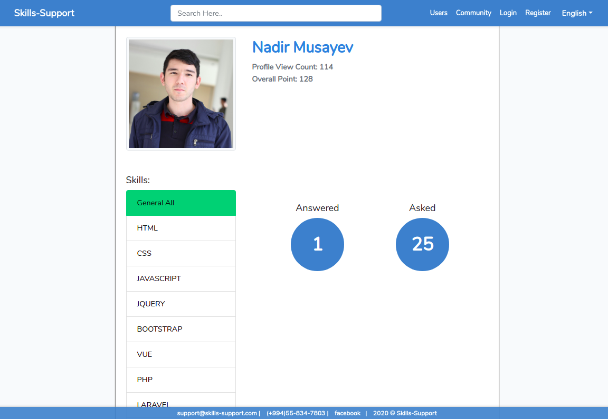
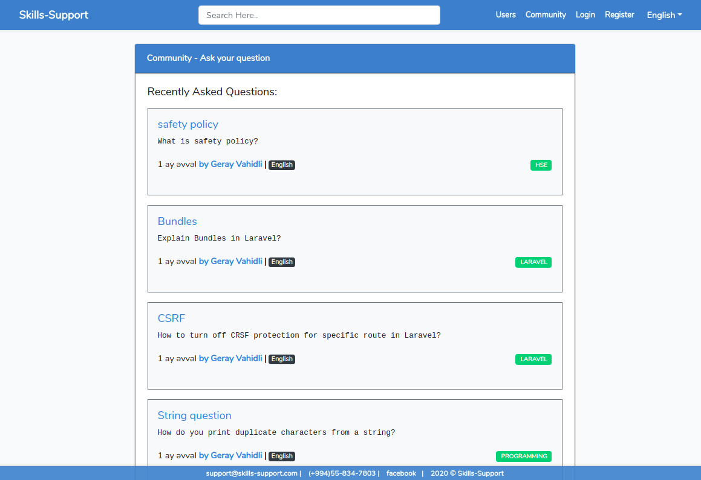

## Skills-Support

Skills-Support is a project which aimed to help people who wants to improve their skills by asking questions, getting 
advice from experts and people who wants to share their experience to the community. This is point based system.

- After registering you will have profile. You can add your skills and languages there. When you add question you will get some amount of point for that skill.
   
   
   
   
- If someone answer to your question, he also will get considered amount of point.

   
   
   
- Your asked or answered questions for each skill will be shown in your profile.

   
   
   
   
   
- If someone make your answer as best answer, You will be awarded 100 points for skills that related to question.
- You can search for other profiles and even view other people's profiles with asked and answered questions for each skill.
   
   
   
   
   
   
- You can view answers of community, or even search for specific question.

   
   
   
- Asking question by choosing your language and skills. Only matched people will be notified for helping You.
   
   
   
   

## How to start?

You want to contribute to the project but do not know how to start? 
1. Just fork the project, and clone it to your local machine.
2. Run `composer install` and `npm install` on project's main directory.
3. Create .env file. Copy all content of .env.example and paste to .env. (In linux based system just run `cp .env.example .env`)
4. Create database and setup your database connection in .env file: 
    ``` 
    DB_DATABASE=db_name
    DB_USERNAME=db_username
    DB_PASSWORD=db_password
    ```
5. Run `php artisan key:generate` in order to generating application key.
6. Finally, run `php artisan migrate` in order to migrating migration files and creating tables in database.

